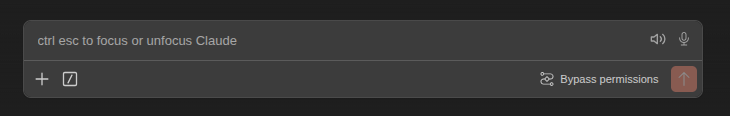
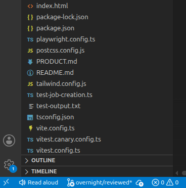
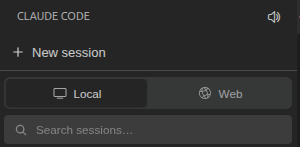
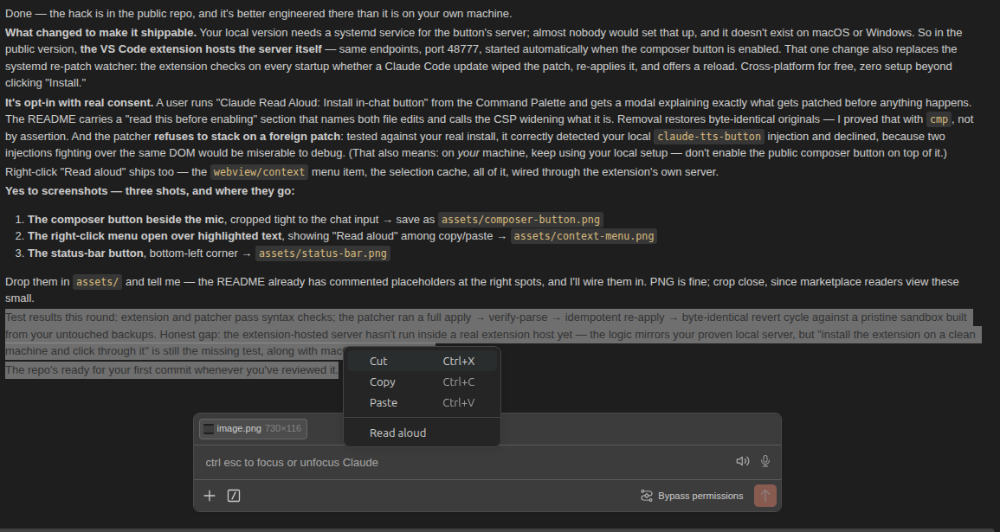
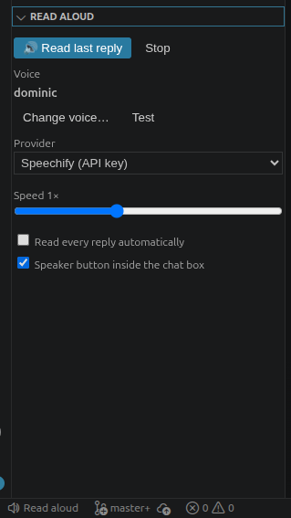
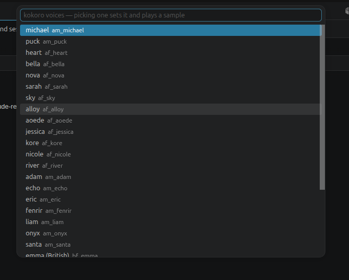

# claude-read-aloud

**Hear Claude's replies instead of reading them.** A speaker button inside
Claude Code's chat box, right-click **Read aloud** on any highlighted text, a
hotkey, and a settings panel in Claude's own sidebar — voices from free system
TTS up to Speechify / ElevenLabs / OpenAI with your own key.



If you work with Claude Code all day, you read all day — and at some point you
stop absorbing and start skimming. Listening shifts the load from your eyes to
your ears: you take in the whole answer, keep your eyes on the code it
describes, and reply better. And when reading itself is the hard part — low
vision, dyslexia, screen fatigue — it makes Claude Code usable at all.

Free out of the box: system voices with zero setup, or one command installs
[Kokoro], a genuinely good local neural voice — no account, no key, 54 voices.

**[▶ Watch the 30-second demo](assets/demo.webm)**

## Two pieces

| Piece | What it gives you |
| --- | --- |
| **Claude Code plugin** (this repo) | the engine: voices, chunked playback, `/read-aloud:*` commands, auto-read hook |
| **VS Code extension** ([`vscode-extension/`](vscode-extension/)) | the buttons: status bar, toolbar, hotkeys, right-click **Read aloud**, the in-chat speaker, and a Read Aloud settings panel inside Claude's sidebar |

Install the plugin first (it's the engine), then the extension if you use
VS Code. Terminal-only users need just the plugin.

## Install

```
claude plugin marketplace add michaelpgifford/claude-read-aloud
claude plugin install read-aloud@claude-read-aloud
```

(Same two steps work inside Claude Code as `/plugin marketplace add …` and
`/plugin install …`, or from a local clone by passing its path to
`marketplace add`.)

Requires Python 3.9+ on your PATH (`python3`, or `python` on Windows).
No packages to install — the whole engine is one standard-library script.

## Use

| | |
| --- | --- |
| `/read-aloud:speak` | read the last reply aloud |
| `/read-aloud:speak-stop` | stop |
| `/read-aloud:speak-auto on` | read **every** reply automatically (off by default) |
| `/read-aloud:speak-status` | show provider, voice, and where the config lives |
| `/read-aloud:voice-setup` | one-time install of the free Kokoro neural voice |

**On Linux, run `/read-aloud:voice-setup` first.** macOS and Windows system
voices are decent out of the box; Linux's stock voice is espeak, which is not.
One command and ~340MB later you have a genuinely pleasant local voice, free
forever — the plugin will remind you once if you skip this.

(Type `/speak` and let completion fill the namespace — commands are listed
under their plugin name.)

Long replies start speaking in ~1–3 seconds regardless of length: text is
split at sentence boundaries into ramped chunks (small first — its size *is*
the time-to-first-sound), and each next chunk synthesises while the previous
one plays, so there are no gaps.

## Voices

| Provider | Cost | Setup |
| --- | --- | --- |
| `system` *(default)* | free | none — uses macOS `say`, Linux speech-dispatcher, or Windows SAPI |
| `kokoro` | free | **`/read-aloud:voice-setup`** — local neural voice, 54 voices, no account (one-time ~340MB download) |
| `speechify` | ~$10 / 1M chars | `export SPEECHIFY_API_KEY=…` |
| `elevenlabs` | from ~$5/mo | `export ELEVENLABS_API_KEY=…` |
| `openai` | ~$15 / 1M chars | `export OPENAI_API_KEY=…` |
| `command` | free | any local engine ([Piper], [Kokoro], …) via a command template |

Config lives at `~/.config/claude-read-aloud/config.json`
(`%APPDATA%\claude-read-aloud\config.json` on Windows):

```json
{
  "provider": "speechify",
  "voice": "oliver",
  "speed": 1.0,
  "auto_read": false
}
```

`voice` is the provider's own voice name/id (macOS: `say -v '?'` lists yours;
cloud providers list voices in their consoles). API keys go in environment
variables, never in the file.

A local neural engine plugs in through `command` — `{text}` is replaced with
the text to speak; add `{out}` if your engine writes a WAV for the plugin to
play (that's what enables gapless chunking):

```json
{
  "provider": "command",
  "command": "piper -m /path/to/voice.onnx -f {out}"
}
```

## The fine print that saves you a support ticket

- **Auto-read is off by default, on purpose.** A working session produces hours
  of speech per day (we measured 4+). Try `/speak-auto on` — most people come
  back to on-demand within a day, and that's the intended workflow.
- **Replies cap at 12,000 characters** (~14 minutes) and say so when cut.
  Code blocks are spoken as "code omitted" — nobody wants JSON read aloud.
- **Stop always works mid-sentence**: `/speak-stop`, or the button/hotkey below.
- Speechify's WAV arrives with broken (streaming) header sizes; the plugin
  repairs them — if you ever hear a burst of static with another tool, that's
  what it was.

## Buttons and hotkeys in VS Code

The companion extension adds, safely and update-proof:

- a status-bar **Read aloud** button (bottom-left, under the chat input),
- a toolbar icon on the Claude Code panel,
- **Ctrl+Alt+S** / **Ctrl+Alt+X** (⌘⌥S / ⌘⌥X on macOS),
- the settings panel, voice picker, right-click menu, and in-chat button below.

Install it from the VS Code Marketplace — search **"Claude Read Aloud"**, or:

```
code --install-extension MichaelGifford.claude-read-aloud-button
```

It auto-detects the installed plugin. (From source instead: clone this repo,
`npx @vscode/vsce package` in `vscode-extension/`, and install the `.vsix`
via *Extensions → … → Install from VSIX*.)

The status-bar button sits bottom-left, directly under the chat input, and the
toolbar icon rides on the Claude Code panel itself:




## The good stuff: in-chat button + right-click "Read aloud"

The two triggers that actually feel native — and, in daily use, the ones you
end up reaching for:

- **A speaker button inside the chat box, right next to the mic.** Click it and
  it reads the reply you're looking at (it reads the *visible* conversation, so
  it can't pick the wrong session). Highlight text first and it reads just that.
- **Highlight any text in the chat → right-click → "Read aloud"** in the same
  menu as copy/paste.

The speaker sits right where your eyes already are, next to the mic:


Highlight, right-click, and it's in the same menu as copy and paste:



The extension offers this once on startup (a small toast); or run
**"Claude Read Aloud: Install in-chat button"** from the Command Palette,
confirm, reload. Undo any time with **"Remove in-chat button"**.

### Settings panel and voice picker

A **Read Aloud** section lives inside Claude Code's own sidebar: current voice
with test, provider switcher, speed, auto-read, and the in-chat button toggle.
**Change voice…** opens a searchable picker of the current provider's voices —
selecting one saves it and plays a sample in that voice immediately.




**Read this part before enabling it.** VS Code offers no way to put a button
inside another extension's webview, so this works by *patching two files of
the installed Claude Code extension* on your machine:

- `webview/index.js` gets a script **appended** (never spliced — an upstream
  change can stop it matching, but can't corrupt the bundle) that inserts the
  button and captures right-click selections.
- `extension.js`'s Content-Security-Policy gains **one** directive,
  `connect-src http://127.0.0.1:48777`, so the button can reach this
  extension's local server. That is a real, if small, widening of the webview
  sandbox — one localhost port — and it's the entire reason this is opt-in
  rather than default.

Originals are backed up beside each file (`*.cra-orig`) and restored exactly on
removal. **Every Claude Code update wipes the patch**; the extension notices on
startup and re-applies it, asking you to reload. Worst case, the button
disappears until the next reload — the hotkeys and status-bar button never
depend on it. If you previously hand-patched these files with something else,
revert that first; the patcher refuses to stack two injections.

This is a userscript-style local mod, in the same spirit as browser extensions
that add buttons to websites. It never leaves your machine. The *right* fix is
Anthropic shipping a TTS affordance natively — if you want that, add your
voice to a feature request on
[anthropics/claude-code](https://github.com/anthropics/claude-code/issues).

## How it decides what to read

- `/speak` and auto-read use the session's own transcript (hooks receive the
  exact path — never a guess).
- The VS Code button scopes to the window's workspace, so a busier session in
  another project can't hijack what gets read.

## License

MIT.

[Piper]: https://github.com/rhasspy/piper
[Kokoro]: https://github.com/thewh1teagle/kokoro-onnx
